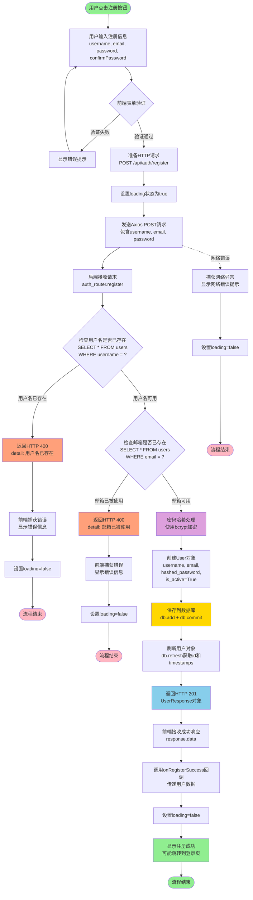
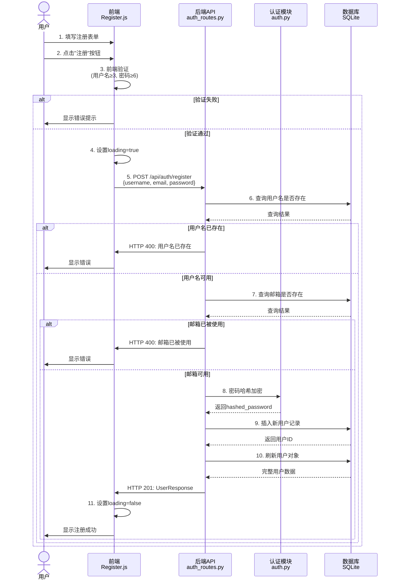

# 用户注册数据流程图

## 概览

本文档详细描述用户注册时的数据流转过程，包括前端验证、后端处理和数据库操作的所有关键节点。

## 完整流程图



## 关键节点详解

### 1. 前端验证阶段（客户端）

**位置**: `frontend/src/components/Register.js` 第25-39行

**验证规则**:
- 用户名长度 ≥ 3个字符
- 密码长度 ≥ 6个字符
- 密码与确认密码必须一致

**失败处理**: 
- 设置错误信息显示给用户
- 阻止表单提交
- 不发送HTTP请求

### 2. HTTP请求准备

**API端点**: `POST http://localhost:8000/api/auth/register`

**请求体格式**:
```json
{
  "username": "用户输入的用户名",
  "email": "用户输入的邮箱",
  "password": "用户输入的密码"
}
```

**请求头**:
```
Content-Type: application/json
```

### 3. 后端接收处理

**位置**: `backend/auth_routes.py` 第17-55行

**数据模型**: `UserRegister` (Pydantic Schema)

**处理流程**:

#### 3.1 用户名唯一性检查
```sql
SELECT * FROM users WHERE username = 'input_username';
```
- 如果存在记录 → 返回 `HTTP 400` 错误
- 如果不存在 → 继续下一步

#### 3.2 邮箱唯一性检查
```sql
SELECT * FROM users WHERE email = 'input_email';
```
- 如果存在记录 → 返回 `HTTP 400` 错误
- 如果不存在 → 继续下一步

#### 3.3 密码加密处理

**位置**: `backend/auth.py` 第26-28行

**加密算法**: bcrypt
```python
hashed_password = pwd_context.hash(password)
```

**安全特性**:
- 自动生成salt
- 不可逆加密
- 防彩虹表攻击

#### 3.4 创建用户记录

**数据库操作**:
```python
new_user = User(
    username=user_data.username,
    email=user_data.email,
    hashed_password=hashed_password,
    is_active=True  # 新用户默认激活
)
db.add(new_user)
await db.commit()
await db.refresh(new_user)
```

**数据库字段**:
- `id`: 自动生成（主键）
- `username`: 用户名（唯一）
- `email`: 邮箱（唯一）
- `hashed_password`: 加密后的密码
- `is_active`: 是否激活（默认True）
- `created_at`: 创建时间（自动生成）
- `updated_at`: 更新时间（自动生成）

### 4. 响应返回

**成功响应 (HTTP 201)**:
```json
{
  "id": 1,
  "username": "testuser",
  "email": "test@example.com",
  "is_active": true,
  "created_at": "2025-10-13T12:00:00",
  "updated_at": "2025-10-13T12:00:00"
}
```

**注意**: 响应中不包含密码信息（安全考虑）

**失败响应 (HTTP 400)**:
```json
{
  "detail": "用户名已存在" 
  // 或 "邮箱已被使用"
}
```

### 5. 前端响应处理

**位置**: `frontend/src/components/Register.js` 第58-71行

**成功处理**:
1. 调用 `onRegisterSuccess(response.data)` 回调
2. 通常会显示成功消息
3. 可能自动跳转到登录页面

**错误处理**:
1. 显示服务器返回的错误信息
2. 保持在注册页面让用户修改
3. 重置loading状态

**网络错误处理**:
- 捕获网络异常（如后端未启动）
- 显示友好的错误提示："网络错误，请检查后端服务是否启动"

## 数据安全措施

### 密码安全
1. ✅ 前端不存储明文密码
2. ✅ 传输过程使用HTTPS（生产环境）
3. ✅ 后端使用bcrypt加密
4. ✅ API响应不返回密码
5. ✅ 数据库存储哈希值而非明文

### 数据验证
1. ✅ 前端表单验证（用户体验）
2. ✅ 后端Pydantic模型验证（数据完整性）
3. ✅ 数据库唯一约束（数据一致性）

### 错误处理
1. ✅ 友好的错误提示
2. ✅ 不暴露敏感信息
3. ✅ 完整的异常捕获

## 性能考虑

### 数据库查询
- 使用异步查询（AsyncSession）
- username和email字段应建立索引（提升查询速度）

### 密码哈希
- bcrypt较慢但更安全（设计如此）
- 异步处理避免阻塞

## 时序图



## 相关文件

- 前端组件: `frontend/src/components/Register.js`
- 后端路由: `backend/auth_routes.py`
- 认证模块: `backend/auth.py`
- 数据模型: `backend/schemas.py` (UserRegister, UserResponse)
- 数据库模型: `backend/database.py` (User表)

## 常见问题排查

### 注册失败常见原因
1. 用户名或邮箱已存在
2. 密码不符合长度要求
3. 网络连接问题
4. 后端服务未启动
5. 数据库连接问题

### 调试建议
- 查看浏览器控制台的网络请求
- 查看后端服务器日志
- 检查数据库中的users表
- 使用Postman测试API接口

